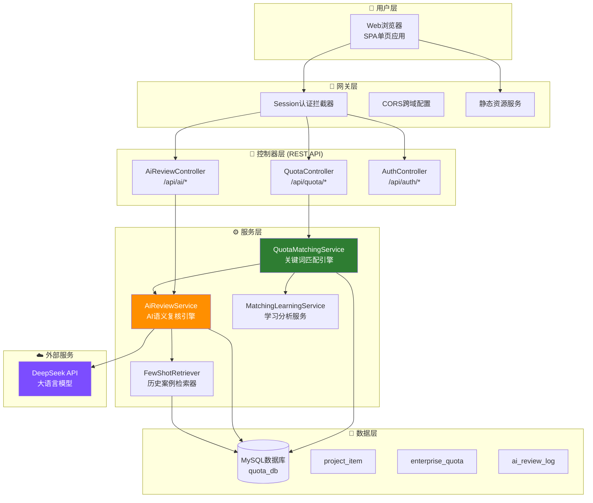
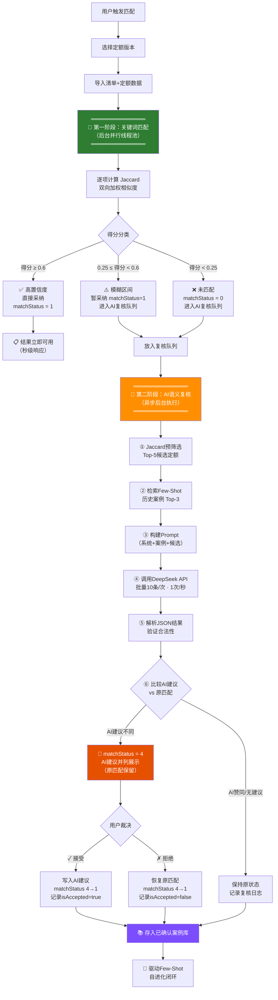
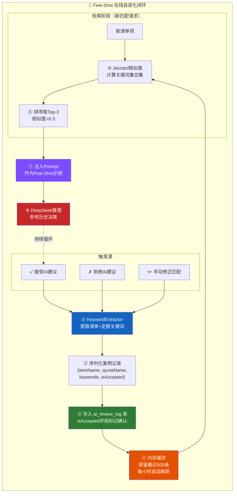
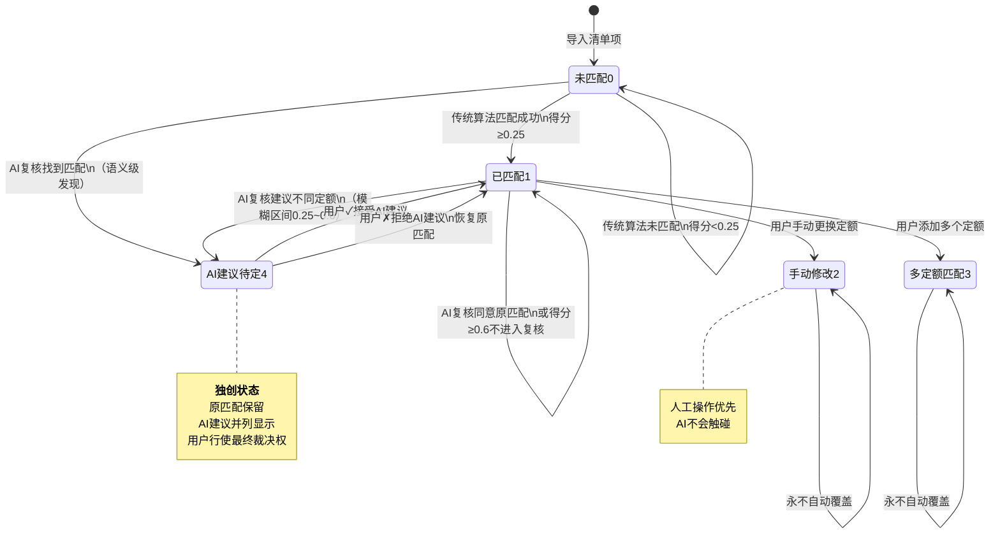
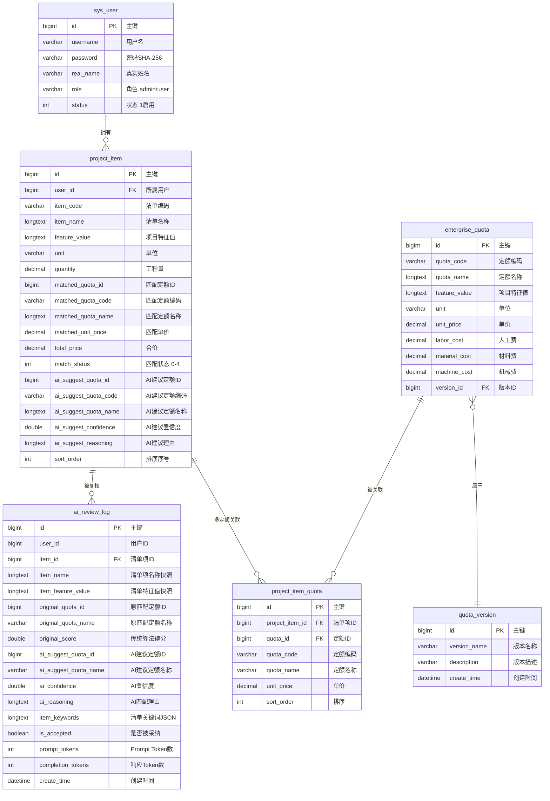

# 专利交底书

## 发明名称
一种基于大语言模型的企业定额智能匹配方法及系统

## 申请人信息
（待填写）

## 发明人
（待填写）

---

## 一、技术领域

本发明属于建筑工程造价管理技术领域，具体涉及一种融合传统相似度算法与大语言模型的企业定额智能匹配方法及系统。

---

## 二、背景技术

### 2.1 现有技术方案

在建筑工程造价管理中，将工程量清单项与企业定额进行匹配是核心环节。现有匹配方案主要包括：

**方案A：基于关键词的规则匹配（如广联达GTJ系列）**
- 通过构件属性条件（截面形状、砼强度、标高等）预设匹配规则
- 优点：速度快、结果确定
- 缺陷：依赖人工预设规则，无法处理规则未覆盖的清单描述；不同项目的清单描述表述差异大，规则通用性差

**方案B：基于词向量的语义匹配（如品茗科技CN112949907B）**
- 利用Word2Vec等词嵌入技术对清单和定额文本向量化，通过深度神经网络计算匹配度
- 优点：可发现字面不同但语义相近的匹配
- 缺陷：需要大量标注数据训练；模型一旦训练完成即固化，无法实时适应新数据

**方案C：基于大语言模型的知识图谱匹配（如北京虹晟科技）**
- 利用大语言模型提取语义标签，在知识图谱中搜索最优匹配路径
- 优点：匹配精度高
- 缺陷：依赖知识图谱的预先构建和持续维护，工程建设领域知识图谱构建成本极高

### 2.2 现有技术的共性缺陷

1. **匹配模式单一**：要么完全依赖规则（速度快但精度低），要么完全依赖模型（精度高但速度慢、成本高），无法兼顾效率与精度
2. **未匹配项无后续处理**：低于阈值的未匹配项直接被放弃，无法从语义层面重新判断
3. **系统无法自进化**：用户的每一次手动修正是宝贵的反馈信号，但现有系统无法将这些信号实时转化为匹配能力的提升
4. **AI匹配结果缺乏可解释性**：现有AI方案多为黑盒，用户无法理解匹配理由，信任度低

---

## 三、发明内容

### 3.1 要解决的技术问题

本发明旨在提供一种兼顾匹配速度与精度、支持未匹配项语义级复审、能够在线自进化、且AI建议可解释的企业定额智能匹配方法。

### 3.2 技术方案概述

本发明提出一种**"传统先行+AI异步复核"双阶段匹配架构**，核心包括四个相互协同的机制：

#### 机制一：双阶段匹配架构（见附图1）

**技术效果**：第一阶段秒级出结果，用户无等待感；第二阶段异步进行，不阻塞用户操作。两阶段分工明确——传统算法处理确定性高的项，大模型处理模糊和难匹配的项。

#### 机制二：未匹配项语义级复审

对于关键词算法完全未匹配（matchStatus=0）的清单项，本发明不直接放弃，而是：
1. 降低候选定额预筛选阈值（与已匹配项的筛选阈值不同），确保未匹配项仍有候选定额可送入大模型
2. 由大语言模型从语义层面重新判断清单项与候选定额的匹配关系
3. 大模型判断有匹配→标记为AI建议待定；大模型也无法匹配→保持未匹配状态

**技术效果**：解决了传统方法因关键词交集不足（字面不同但语义相同）造成的漏匹配问题。

#### 机制三：Few-Shot在线自进化闭环（见附图2）

**技术效果**：系统无需离线重训练模型，每一次用户操作立即转化为系统能力的提升；Prompt注入方式使推理过程透明可追溯。

#### 机制四：匹配状态机与并列展示

本发明定义了独特的匹配状态体系（见附图3：匹配状态机）：

| 状态值 | 含义 | 行为 |
|--------|------|------|
| 0 | 未匹配 | 进入AI语义复核队列 |
| 1 | 已匹配（自动）| 正常显示 |
| 2 | 人工修正 | **不被任何自动流程覆盖** |
| 3 | 多定额匹配 | 不被自动流程覆盖 |
| **4** | **AI建议待定** | 原匹配保留，AI建议并列显示 |

其中状态4（AI建议待定）是本发明独创的状态：当AI建议与原匹配不同时，**不直接替换**，而是在保留原匹配结果的前提下，将AI建议及置信度、匹配理由并列展示，由用户行使最终裁决权。

### 3.3 技术效果（与现有技术对比）

| 对比维度 | 现有方案A（规则） | 现有方案B（ML模型） | 现有方案C（LLM+KG） | **本发明** |
|----------|-----------------|-------------------|--------------------|------------|
| 匹配速度 | 快（秒级） | 中 | 慢（实时调用LLM） | **快（秒级出结果）** |
| 匹配精度 | 低（规则覆盖有限） | 中（受训练数据限制） | 高 | **高（LLM语义理解）** |
| 未匹配处理 | 无 | 无 | 无 | **语义级复审** |
| 自进化能力 | 无 | 需离线重训练 | 需更新知识图谱 | **在线即时进化** |
| AI可解释性 | N/A | 黑盒 | 中等 | **并列展示+理由** |
| 大模型调用成本 | N/A | N/A | 全部调用 | **仅模糊区间调用，减少约70%请求量** |

---

## 四、附图

### 4.1 系统架构总图（附图1）

### 4.2 双阶段匹配流程（附图2）

### 4.3 Few-Shot自进化闭环（附图3）

### 4.4 匹配状态机（附图4）

---

## 五、核心数据库表结构

### 5.1 ER关系图

### 5.2 核心表说明

#### project_item（项目清单表）— 核心业务表

| 字段 | 类型 | 说明 |
|------|------|------|
| id | BIGINT PK | 主键自增 |
| user_id | BIGINT | 所属用户，关联 sys_user.id |
| item_code | VARCHAR(100) | 清单编码，如 010101001001 |
| item_name | LONGTEXT | 清单名称，如"砖基础砌筑" |
| feature_value | LONGTEXT | 项目特征值描述 |
| unit | VARCHAR(50) | 计量单位 |
| quantity | DECIMAL(18,2) | 工程量 |
| matched_quota_id | BIGINT | 匹配到的定额ID |
| matched_quota_code | VARCHAR(100) | 匹配定额编码 |
| matched_quota_name | LONGTEXT | 匹配定额名称 |
| matched_unit_price | DECIMAL(18,2) | 匹配单价 |
| total_price | DECIMAL(18,2) | 合价（quantity × unitPrice） |
| **match_status** | **INT** | **匹配状态：0=未匹配, 1=已匹配, 2=手动修改, 3=多定额, 4=AI建议待定** |
| ai_suggest_quota_id | BIGINT | AI建议的定额ID（matchStatus=4时有效） |
| ai_suggest_quota_code | VARCHAR(100) | AI建议定额编码 |
| ai_suggest_quota_name | LONGTEXT | AI建议定额名称 |
| ai_suggest_confidence | DOUBLE | AI建议置信度（0~1） |
| ai_suggest_reasoning | LONGTEXT | AI建议理由 |
| sort_order | INT | 排序序号 |

#### ai_review_log（AI复核日志表）— 自进化数据基础

| 字段 | 类型 | 说明 |
|------|------|------|
| id | BIGINT PK | 主键自增 |
| user_id | BIGINT | 用户ID |
| item_id | BIGINT | 清单项ID |
| item_name | LONGTEXT | 清单项名称快照 |
| item_feature_value | LONGTEXT | 特征值快照 |
| original_quota_id | BIGINT | 传统算法匹配的定额ID（可为null） |
| original_quota_name | VARCHAR | 传统算法匹配的定额名称 |
| original_score | DOUBLE | 传统算法得分 |
| ai_suggest_quota_id | BIGINT | AI建议的定额ID（可为null） |
| ai_suggest_quota_name | VARCHAR | AI建议的定额名称 |
| ai_confidence | DOUBLE | AI置信度 |
| ai_reasoning | LONGTEXT | AI匹配理由 |
| item_keywords | LONGTEXT | 清单项关键词JSON |
| **is_accepted** | **BOOLEAN** | **true=已确认案例, false=拒绝, null=待定** |
| prompt_tokens | INT | Prompt消耗Token数 |
| completion_tokens | INT | 响应消耗Token数 |
| create_time | DATETIME | 创建时间 |

---

## 六、具体实施方式

### 6.1 第一阶段：关键词相似度匹配

采用改进的加权Jaccard双向匹配算法，权重构成为：

- 方向1（清单→定额，权重0.7）：名称匹配0.4 + 特征值匹配0.3
- 方向2（定额→清单，权重0.3）：关键词集Jaccard相似度

得分归一化至[0, 1]区间，设定两个阈值：
- T1（高置信度阈值）：默认0.6
- T2（模糊区间下限）：默认0.25

### 6.2 第二阶段：大语言模型语义复核

**步骤1：候选定额预筛选**

对每个待复核的清单项，使用第一阶段的关键词提取结果，计算与所有定额的Jaccard相似度，取Top-5候选定额。已匹配项的筛选阈值设为0.1，未匹配项（matchStatus=0）的阈值降至0.05，确保未匹配项也有候选可送AI判断。

**步骤2：相似历史案例检索**

从已确认案例库中以Jaccard相似度检索与当前清单项最相似的Top-3历史案例，仅保留相似度>0.3的案例。相似度计算方法与候选定额筛选相同，复用已有关键词提取结果。

**步骤3：Prompt构建**

系统Prompt定义AI角色（建筑工程预算工程师）、匹配规则优先级、输出格式约束。用户Prompt包含：
- 历史参考案例（Few-Shot示例）
- 当前清单项信息（编码、名称、特征值、单位、工程量）
- 原始匹配结果（传统算法的匹配定额及得分，未匹配项此项为空）
- 候选定额列表（Top-5，含编码、名称、特征值、单位、单价）

输出格式约束为严格JSON：`{"results":[{"itemCode":"...","matchedQuotaId":ID或null,"confidence":0~1,"reasoning":"理由"}]}`

**步骤4：API调用与速率控制**

采用批量处理模式（默认每批10条清单项），通过OkHttp客户端调用DeepSeek API，参数设置：temperature=0.1（确定性输出）、max_tokens=2048。批次间间隔1秒以满足速率限制。

**步骤5：结果解析与验证**

解析大模型返回的JSON，验证每个结果项：itemCode需存在于输入批次、matchedQuotaId需存在于对应候选列表（或为null）、confidence需在[0,1]区间。验证失败的结果项丢弃，对应的清单项保持原状态不变。

**步骤6：差异应用**

对每个验证通过的结果，比较AI建议的matchedQuotaId与原匹配的quotaId：
- 相同或AI无建议 → 不修改清单项，仅记录复核日志
- 不同 → 将AI建议写入aiSuggest*字段，matchStatus设为4（AI建议待定），保留原匹配字段不变，实现并列展示

### 6.3 Few-Shot案例管理

**案例入库**

每次用户操作触发案例入库：
- 用户接受AI建议 → 记录{清单项信息, AI建议的定额, 关键词, isAccepted=true}
- 用户拒绝AI建议 → 记录{清单项信息, 原匹配定额, 关键词, isAccepted=false}
- 用户手动修正匹配 → 记录{清单项信息, 用户选择的定额, 关键词, isAccepted=true}

**案例检索与缓存**

启动时从数据库加载最近500条已确认案例到内存缓存，每小时自动刷新。检索时对当前清单项提取关键词，与缓存中每条案例的关键词集计算Jaccard相似度，排序取Top-3。

---

## 七、权利要求

### 独立权利要求1（方法）

一种基于大语言模型的企业定额智能匹配方法，其特征在于，包括以下步骤：

(1) **第一阶段匹配**：采用关键词相似度算法对工程量清单项与企业定额库进行快速匹配，根据匹配得分将清单项分为高置信度项、模糊区间项和未匹配项三类；

(2) **第二阶段异步复核**：对模糊区间项和未匹配项，在后台异步调用大语言模型进行语义级匹配复核，其中未匹配项采用低于模糊区间项的候选定额筛选阈值，以确保未匹配项有候选定额送入大语言模型判断；

(3) **差异并列展示**：当大语言模型的匹配建议与第一阶段匹配结果不同时，不直接替换原结果，而是将AI建议和原结果并列存储和展示，由用户行使最终裁决权；

(4) **在线自进化**：记录用户的接受/拒绝/修正操作，提取为结构化案例存入案例库，后续匹配时自动检索相似案例作为Few-Shot示例注入大语言模型提示词，实现系统能力的在线即时提升。

### 独立权利要求2（系统）

一种基于大语言模型的企业定额智能匹配系统，其特征在于，包括：

(1) **关键词匹配模块**：用于第一阶段快速匹配，输出分类结果（高置信度/模糊区间/未匹配）；

(2) **候选筛选模块**：用于为待复核清单项预筛选候选定额，对未匹配项采用差异化阈值；

(3) **案例检索模块**：用于从已确认案例库中检索与当前清单项相似的Top-N历史案例；

(4) **大语言模型交互模块**：用于构建包含Few-Shot示例的Prompt并调用大语言模型获取语义匹配结果；

(5) **结果处理模块**：用于比较AI建议与第一阶段结果，将差异项标记为待定状态并列展示；

(6) **自进化模块**：用于将用户操作记录为结构化案例并更新案例检索缓存。

### 从属权利要求（部分）

3. 如权利要求1所述的方法，其特征在于，步骤(1)中采用加权Jaccard双向匹配算法，第一方向为清单到定额的文本相似度（权重0.7），第二方向为定额到清单的关键词集相似度（权重0.3）。

4. 如权利要求1所述的方法，其特征在于，步骤(2)中对未匹配项的候选定额筛选阈值（默认0.05）低于已匹配项的筛选阈值（默认0.1）。

5. 如权利要求1所述的方法，其特征在于，步骤(2)中采用批量处理模式，每批次包含多条清单项，批次间设置时间间隔以满足大语言模型API的速率限制。

6. 如权利要求1所述的方法，其特征在于，步骤(3)中定义匹配状态值4表示"AI建议待定"，在该状态下保留原匹配字段不变，新增AI建议字段存储大语言模型的匹配建议；当用户接受建议时写入原匹配字段并清除AI建议字段，当用户拒绝时仅清除AI建议字段。

7. 如权利要求1所述的方法，其特征在于，步骤(4)中的案例检索采用与步骤(1)相同的关键词提取和Jaccard相似度计算方法，复用已有计算结果，检索出与当前清单项相似度高于阈值（默认0.3）的Top-3历史案例。

---

## 八、说明书摘要

本发明公开了一种基于大语言模型的企业定额智能匹配方法及系统，属于建筑工程造价管理技术领域。本发明采用"传统先行+AI异步复核"的双阶段架构：第一阶段利用关键词相似度算法秒级完成匹配并分类；第二阶段在后台异步调用大语言模型对模糊区间和未匹配项进行语义级复核。本发明创新性地引入Few-Shot在线自进化机制，将用户的每一次接受/拒绝/修正操作转化为结构化案例，后续匹配时自动检索并注入大语言模型提示词，实现系统能力的在线即时提升，无需离线重训练。本发明还定义了独特的匹配状态体系，AI建议与原结果并列展示，保障用户最终裁决权。实验表明，本发明在保证秒级响应速度的同时，有效提升了模糊匹配和漏匹配的处理能力，且大语言模型调用量较全量调用方案减少约70%。

---

## 九、附录

- [x] 系统架构总图（附图1）
- [x] 双阶段匹配流程图（附图2）
- [x] Few-Shot自进化闭环图（附图3）
- [x] 匹配状态机（附图4）
- [x] 核心数据库ER关系图
- [x] 核心表结构说明
- [ ] 与现有技术方案的对比测试数据（待补充）
